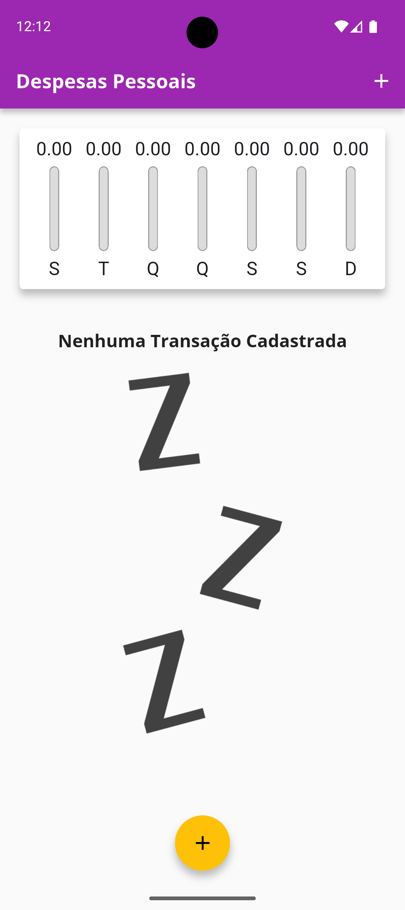
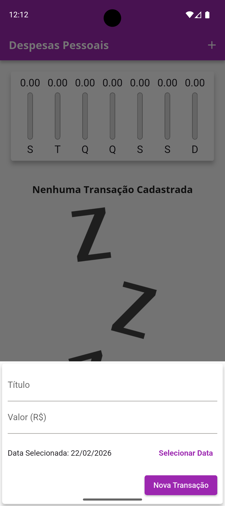
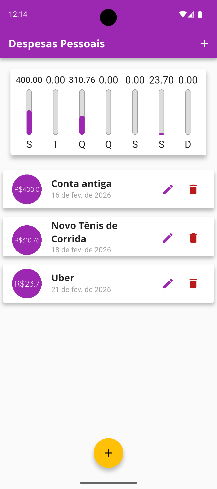
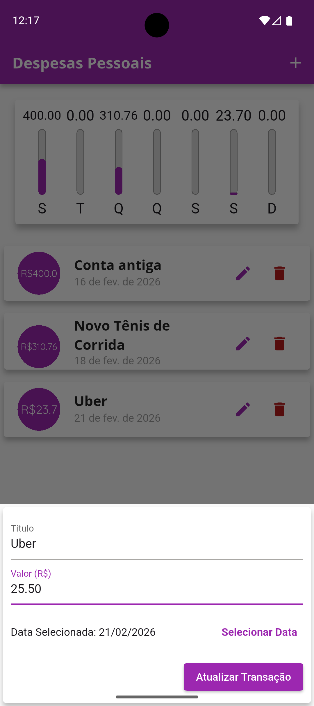
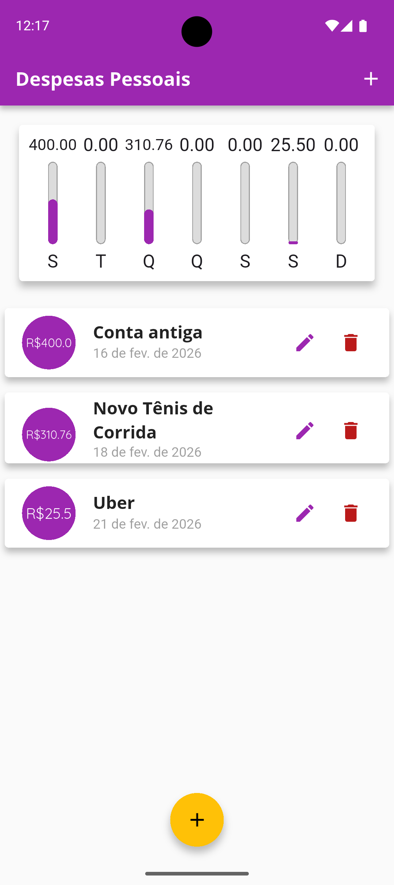
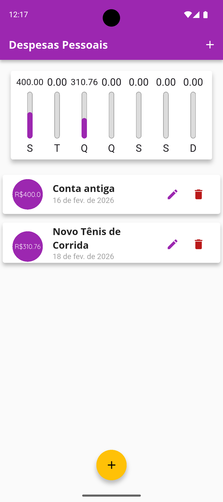

# 💰 Expenses - Controle de Despesas Pessoais

Um aplicativo Flutter moderno e intuitivo para gerenciar suas despesas pessoais de forma simples e eficiente.

## 📱 Sobre o Projeto

O **Expenses** é uma aplicação mobile desenvolvida em Flutter para ajudar você a controlar suas despesas diárias. Com uma interface limpa e amigável, você pode adicionar, visualizar e remover transações, além de acompanhar um gráfico visual das suas despesas nos últimos 7 dias.

## ✨ Funcionalidades

- ✅ **Adicionar Transações**: Registre suas despesas com título, valor e data
- ✏️ **Editar Transações**: Modifique título, valor e data de transações já cadastradas
- 📊 **Gráfico Semanal**: Visualize suas despesas dos últimos 7 dias em um gráfico de barras intuitivo
- 📋 **Lista de Transações**: Veja todas as suas transações organizadas com data e valor
- 🗑️ **Remover Transações**: Delete transações com um simples clique
- 🇧🇷 **Localização PT-BR**: Interface completamente em português do Brasil
- 🎨 **Design Personalizado**: Interface moderna com tema roxo e âmbar

## 🛠️ Tecnologias Utilizadas

- **Flutter** - Framework de desenvolvimento mobile
- **Dart** - Linguagem de programação
- **intl** - Internacionalização e formatação de datas (PT-BR)
- **Material Design** - Design system do Google

## 📂 Estrutura do Projeto

```
lib/
├── main.dart                    # Arquivo principal e configuração do app
├── models/
│   └── transaction.dart         # Modelo de dados da transação
└── components/
    ├── chart.dart               # Componente do gráfico semanal
    ├── chart_bar.dart           # Componente de barra individual do gráfico
    ├── transaction_form.dart    # Formulário para adicionar transações
    └── transaction_list.dart    # Lista de transações
```

## 🚀 Como Executar o Projeto

### Pré-requisitos

- Flutter SDK (^3.9.2)
- Dart SDK
- Android Studio / Xcode (para emuladores)
- Um dispositivo físico ou emulador configurado

### Instalação

1. Clone o repositório:

```bash
git clone https://github.com/rafaelmachadobr/expenses.git
cd expenses
```

2. Instale as dependências:

```bash
flutter pub get
```

3. Verifique se há dispositivos disponíveis:

```bash
flutter devices
```

4. Execute o aplicativo:

```bash
flutter run
```

## 📦 Dependências

```yaml
dependencies:
  flutter:
    sdk: flutter
  intl: ^0.20.2 # Internacionalização e formatação de datas
  cupertino_icons: ^1.0.8 # Ícones do iOS

dev_dependencies:
  flutter_test:
    sdk: flutter
  flutter_lints: ^5.0.0 # Linting e boas práticas
```

## 📸 Screenshots

<div align="center">
  
  
  
  
  
  
</div>

## 🎨 Recursos Visuais

### Fontes Customizadas

- **OpenSans**: Utilizada em títulos e AppBar
- **Quicksand**: Fonte padrão do aplicativo

### Tema de Cores

- **Primária**: Roxo (`Colors.purple`)
- **Secundária**: Âmbar (`Colors.amber`)

### Assets

- Imagens: `assets/images/waiting.png`
- Fontes: `assets/fonts/`

## 🏗️ Build para Produção

### Android

```bash
flutter build apk --release
```

### iOS

```bash
flutter build ios --release
```
